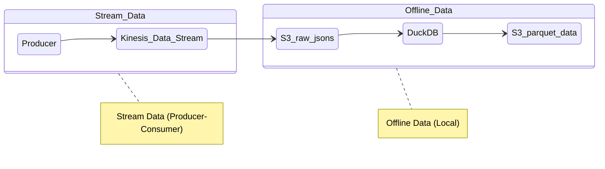

## Real-time Data Processing with AWS: Kinesis, S3, Lambda, and DuckDB

In this scenario, data arriving periodically from the source is sent to Kinesis Data Streams and then stored in S3 in JSON format via a triggered Lambda function. Finally, using DuckDB, the raw data is consolidated and written back to S3 as a single parquet file.

Detailed blog post: [Stream 102 | AWS ile Gerçek Zamanlı Veri İşleme: Kinesis, S3, Lambda ve DuckDB](https://silverstone1903.github.io/posts/2025/06/stream-102/) (Turkish)

----

### Project Pipeline

### Screenshots
 

 

### Resources
- [DuckDB](https://duckdb.org/docs/stable/index)

